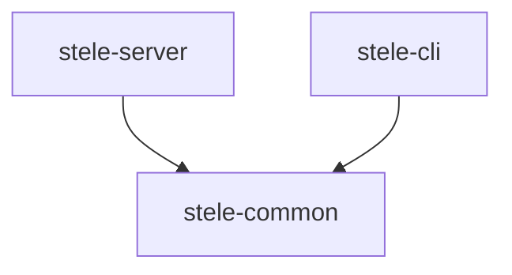
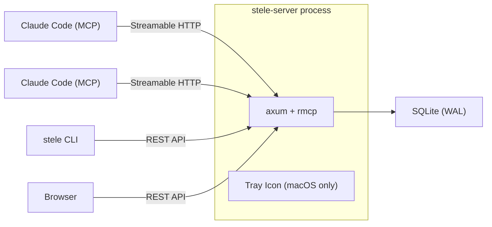

# Architecture Overview

## What is Stele

Stele is a shared memory server for Claude Code. It exposes an MCP (Model Context Protocol) interface over Streamable HTTP so multiple Claude Code instances across different machines can store and retrieve shared knowledge. Storage is SQLite with no external database dependencies.

The workspace produces two binaries:

- `stele-server` — the full server (MCP + REST API, optional macOS tray)
- `stele` — a sync CLI client for interacting with a running server over REST

## Workspace Structure

The Cargo workspace lives at `apps/stele/` and contains three crates:

### `stele-common`

Shared types library. Contains `models.rs` and `query.rs`. No async, no heavy dependencies — only `serde` and `serde_json`. Used by both the server and CLI so domain types are defined once.

### `stele-server`

MCP and REST server. Dependencies include axum, rmcp, rusqlite (bundled), and tokio. On macOS with the `desktop` feature enabled, also pulls in tray-icon, muda, winit, and eframe for the menu bar app. Binary name: `stele-server`.

### `stele-cli`

Sync CLI client. Uses `ureq` for HTTP, `clap` for argument parsing, and TOML config profiles for storing server addresses. Binary name: `stele`.

## Crate Dependency Diagram



## Runtime Architecture



## Feature Flags

Two mutually exclusive feature sets in `stele-server`:

- **`desktop`** (default) — Pulls in tray-icon, muda, image, dirs, winit, and eframe. Runs the macOS menu bar app on the main thread with the server on a background thread.
- **`headless`** — No GUI dependencies. Traditional `#[tokio::main]` entry point with Ctrl+C shutdown. Used for Linux, Docker, and CI.

Build headless with:

```bash
cargo build --features headless --no-default-features
```

## Concurrency Model

- **DB access** — `Arc<Mutex<Connection>>` (tokio Mutex). Single writer; each request acquires the lock for the duration of the DB call.
- **Desktop mode** — main thread runs the winit event loop (tray icon); a background `std::thread` owns a tokio runtime that runs the server.
- **Headless mode** — `#[tokio::main]` on the main thread; no separate OS thread required.
- **Live rebind** — `BindState` struct holds `RwLock<String>` for the current bind address and a `tokio::sync::Notify` for signalling rebind. The server loop waits on shutdown, rebind, or server-exit via `tokio::select!`, then restarts the listener on the new address without restarting the process.

## Key Dependencies

| Crate            | Purpose                               | Used By                  |
| ---------------- | ------------------------------------- | ------------------------ |
| rmcp             | MCP protocol (Streamable HTTP server) | stele-server             |
| axum             | HTTP framework (REST API)             | stele-server             |
| rusqlite         | SQLite (bundled)                      | stele-server             |
| tokio            | Async runtime                         | stele-server             |
| schemars (v1)    | JSON Schema for MCP tool params       | stele-server             |
| clap             | CLI argument parsing                  | stele-server, stele-cli  |
| ureq             | Sync HTTP client                      | stele-cli                |
| serde/serde_json | Serialization                         | all crates               |
| tray-icon/muda   | macOS menu bar (desktop feature)      | stele-server             |
| eframe/egui      | Settings dialog GUI (desktop feature) | stele-server             |
