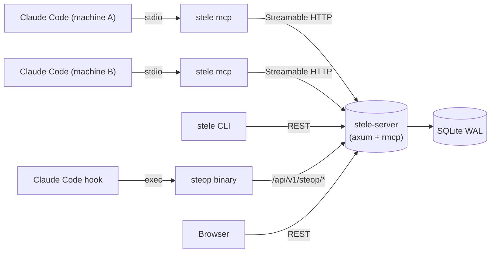

# Architecture Overview

Stele is a shared memory server for Claude Code, plus a small ecosystem of
helpers around it. This document is the top-level map: the components, how
they talk to each other, and the design choices that make the moving parts
worth explaining. For deeper internals, follow the per-component links.

## Repository Components

| Component             | Path                              | Language | Role                                                                  |
| --------------------- | --------------------------------- | -------- | --------------------------------------------------------------------- |
| **stele server**      | `apps/stele/crates/stele-server/` | Rust     | MCP + REST + tray. The shared-memory hub. Owns the SQLite DB.         |
| **stele CLI / proxy** | `apps/stele/crates/stele-cli/`    | Rust     | REST client and MCP stdio↔HTTP proxy. Multi-profile config.           |
| **stele common**      | `apps/stele/crates/stele-common/` | Rust     | Shared types library used by both server and CLI.                     |
| **steop binary**      | `apps/steop/`                     | Go       | Companion CLI invoked by Claude Code hooks; talks to stele over REST. |
| **stele plugin**      | `plugins/stele/`                  | —        | Claude Code plugin that wires `stele mcp` and ships skills.           |
| **steop plugin**      | `plugins/steop/`                  | —        | Claude Code plugin that ships the agentic workflow chain + hooks.     |
| **stelite plugin**    | `plugins/stelite/`                | —        | Companion plugin (own cadence; not always co-bumped).                 |

Deeper docs:

- Stele server internals: [`stele/server.md`](stele/server.md), [`stele/data-model.md`](stele/data-model.md), [`stele/rest-api.md`](stele/rest-api.md), [`stele/mcp-tools.md`](stele/mcp-tools.md)
- Stele CLI: [`stele/cli.md`](stele/cli.md)
- Build, deploy, test: [`stele/deployment.md`](stele/deployment.md), [`stele/testing.md`](stele/testing.md)
- Steop pipeline & runtime: [`steop/DESIGN.md`](steop/DESIGN.md)
- Versioning across all components: [`versioning.md`](versioning.md)

## Runtime Topology



The stele server is the single source of truth. Every other component is a
client that reads or writes via either the MCP tool surface or the
`/api/v1/*` REST surface.

## Design: Local CLI as MCP Transport

Claude Code's MCP integration is configured **once**, against a local stdio
command:

```
stele mcp
```

Notably, Claude Code does **not** speak Streamable HTTP directly to a
`stele-server`. Instead it spawns the local `stele` CLI, which acts as a
stdio↔HTTP MCP proxy: it reads JSON-RPC from stdin, forwards each call to a
`stele-server` over Streamable HTTP, and pipes the response back to stdout.

The reason is configuration ergonomics. The CLI owns a multi-profile config
file (`~/.config/stele/config.toml`) that maps profile names to server URLs
and auth keys. Switching which server Claude Code talks to — or pointing two
Claude Code instances at two different servers — becomes a CLI-level concern:

```bash
stele config use work        # switch active profile
stele mcp --profile home     # one-shot override for a single session
```

Claude Code's MCP settings never need to change. Without this indirection
every server switch would mean editing each Claude Code instance's MCP
configuration and restarting it. With the CLI-as-proxy design:

- **One MCP entry** in Claude Code config covers any stele server, anywhere.
- **Profile switches** are a CLI command, not a settings-file edit.
- **Multi-server use** (e.g. personal scope on one host, team scope on
  another) is just a profile flag per session.
- **Auth keys, custom URLs, and TLS settings** live in the CLI config file
  rather than being duplicated into Claude Code config.

Direct Streamable HTTP to `stele-server` still works (the server exposes
`/mcp` natively) and is the right choice for browser-based or
non-Claude-Code MCP clients. The stdio proxy is purely for the Claude Code
fleet, where reconfiguration friction is the bottleneck.

## Steop Companion

The `steop` Go binary is the second client of the server. It is invoked by
Claude Code hooks (PreToolUse, PostToolUse, SessionStart, etc.) and persists
per-session workflow state to stele via the dedicated
`/api/v1/steop/*` REST surface. See [`steop/DESIGN.md`](steop/DESIGN.md) for
the pipeline, hook taxonomy, and state model.
