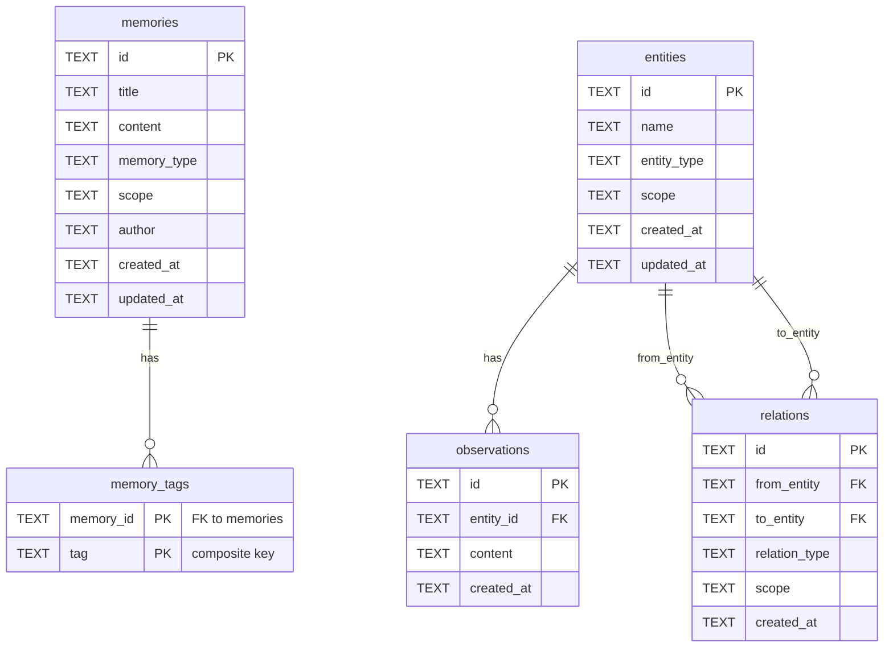

# Data Model & Storage

## SQLite Configuration

- **Journal mode** — WAL (Write-Ahead Logging) for concurrent reads without blocking writers.
- **Foreign keys** — enabled at connection open time (`PRAGMA foreign_keys = ON`).
- **Single file** — path is configurable via `--db` CLI flag or `STELE_DB` environment variable.
- **Desktop default** — `~/Library/Application Support/Stele/stele.db`.

> **Note (post-v0.16.0 / PRD-020):** `steop_mailbox` is the only `steop_*`-prefixed table on stele-server. Session KV, state, storage, and event log moved to a local steop SQLite DB at `~/.local/share/steop/steop.db` — see [../steop/local-storage.md](../steop/local-storage.md).

## Schema Diagram



## Flat Memories

The `memories` table stores general knowledge entries:

- **Primary key** — ULID, stored as TEXT.
- **Fields** — `title`, `content`, `memory_type`, `scope`, `author`, `created_at`, `updated_at`.
- **`MemoryType` enum** — `knowledge`, `decision`, `convention`, `troubleshooting`, `reference`, `other`.

The `memory_tags` join table stores the many-to-many relationship between memories and tags:

- **Composite primary key** — `(memory_id, tag)`.
- **Cascade delete** — removing a memory removes all its tags automatically.
- **Tag updates** — on update, all existing tags for the memory are deleted and the new set is re-inserted. There is no partial patch for tags.

## Knowledge Graph

Three tables model the graph:

- **`entities`** — nodes in the graph. `UNIQUE(name, scope)` constraint ensures names are unique within a scope. Deleting an entity cascades to its observations and all relations that reference it.
- **`observations`** — atomic facts attached to an entity (e.g. "uses axum 0.7"). Foreign key to `entities` with CASCADE delete.
- **`relations`** — directed edges between two entities with a `relation_type` label. `UNIQUE(from_entity, to_entity, relation_type)` prevents duplicate edges. Foreign key constraints on both `from_entity` and `to_entity` with CASCADE delete. `scope` is denormalised onto the relation for filtering.

Entity creation is idempotent: if an entity with the same name and scope already exists, the create operation appends the supplied observations to the existing entity rather than failing or overwriting.

## Full-Text Search

Three FTS5 virtual tables operate in content-sync mode (`content='<source_table>'`):

| FTS table         | Source table   | Indexed columns          |
| ----------------- | -------------- | ------------------------ |
| `memories_fts`    | `memories`     | `title`, `content`       |
| `entities_fts`    | `entities`     | `name`, `entity_type`    |
| `observations_fts`| `observations` | `content`                |

Each source table has INSERT, UPDATE, and DELETE triggers that keep the FTS index in sync. Queries use the `MATCH` operator with FTS5 ranking (`bm25`) to order results by relevance.

`search_nodes` queries both `entities_fts` and `observations_fts` and returns the union of matching entities (with their observations).

## Scopes

Scopes are hierarchical strings that organise memories and entities:

- **Format** — slash-separated path segments, e.g. `team-a/frontend`.
- **Prefix matching** — querying a scope also returns all descendants:
  ```sql
  scope = ?1 OR scope LIKE ?1||'/%' ESCAPE '\'
  ```
  Querying `team-a` matches `team-a`, `team-a/frontend`, and `team-a/backend`.
- **Write operations** — always single-scope. Each memory or entity belongs to exactly one scope.
- **Read operations** — accept multiple scopes as a string or array. Each scope is prefix-matched independently and results are unioned.

## Tags

Tags are flat labels associated with memories via the `memory_tags` join table:

- **Filter mode — union (default)** — returns memories that have ANY of the specified tags.
- **Filter mode — intersection (`match_all_tags=true`)** — returns only memories that have ALL of the specified tags.

Tags have no hierarchy and no separate metadata table — they exist only as strings in `memory_tags`.

## IDs

All primary keys are ULIDs (Universally Unique Lexicographically Sortable Identifiers):

- **Time-sortable** — the first 48 bits encode a millisecond timestamp, so rows sort chronologically by ID.
- **Globally unique** — 80 bits of randomness ensure uniqueness without coordination.
- **Format** — 26-character Crockford Base32 string, stored in SQLite TEXT columns.
- **Generated at insert time** — the server generates the ULID before writing to the DB; the ID is returned to the caller in the response.
